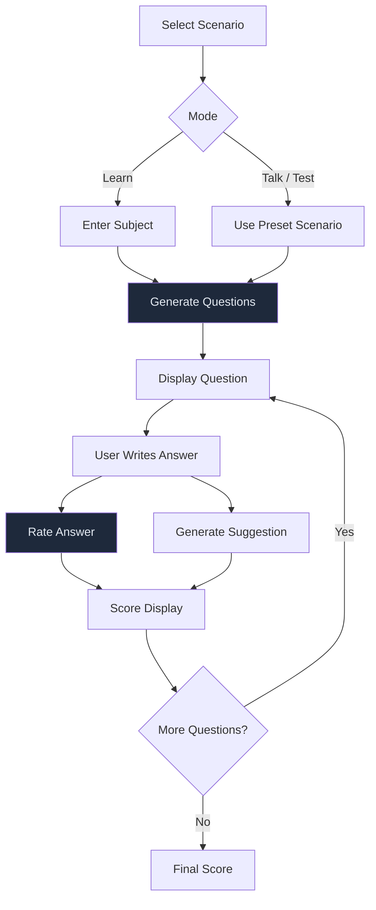

# TutorAI

Interactive educational platform that uses LangChain and OpenAI to generate questions, evaluate free-form answers, and provide personalized feedback across multiple learning scenarios.



## Features

- **Three learning modes** -- *Learn* (custom subject), *Talk* (conversational practice), and *Test* (scenario-based assessment)
- **Dynamic question generation** -- LangChain prompt templates generate contextual questions per selected scenario
- **Multi-dimensional scoring** -- Each answer is rated on multiple criteria and returned as a structured JSON score
- **Targeted suggestions** -- Identifies the weakest scoring dimension and generates specific improvement advice
- **Cumulative progress** -- Running score tracked across all questions in a session

## Quick Start

```bash
git clone https://github.com/Akasxh/TutorAI.git
cd TutorAI
pip install -r requirements.txt
streamlit run main.py
```

Enter your OpenAI API key in the sidebar, select a scenario, and start learning.

## Project Structure

```
TutorAI/
├── main.py              # Streamlit UI and session management
├── tutor_model.py       # Tutor class: question generation, answer rating, suggestions
├── templates.py         # Prompt templates and scenario definitions
├── requirements.txt
└── LICENSE
```

## Tech Stack

| Component | Technology |
|-----------|-----------|
| UI | Streamlit |
| LLM | OpenAI GPT-3 via LangChain |
| Prompt Engineering | LangChain PromptTemplate |
| Runtime | Python 3.8+ |

## License

MIT
